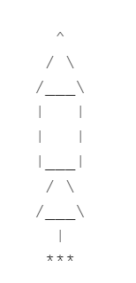

# ClearForTakeoff
Final Project for CS155
## Program Description
This program is an ASCII animation of a rocket ship that blasts away in an exciting fashion, off to explore worlds unknown!

### Notes
Directions to download simulator: https://highered.mheducation.com/sites/0072467509/student_view0/lc-3_simulator.html \
Download the LC 3 Simulator Windows Version 3.01 (385.0K)\
Open .asm file in simulator\
Press the wrench\
Go to simulator in top right corner\
**IMPORTANT**\
Click view -> actual size -> view again -> zoom out ONCE (this is for the graphics of the animation) \
Click the stop sign at x3008 (this will correctly tell the program where to halt)
